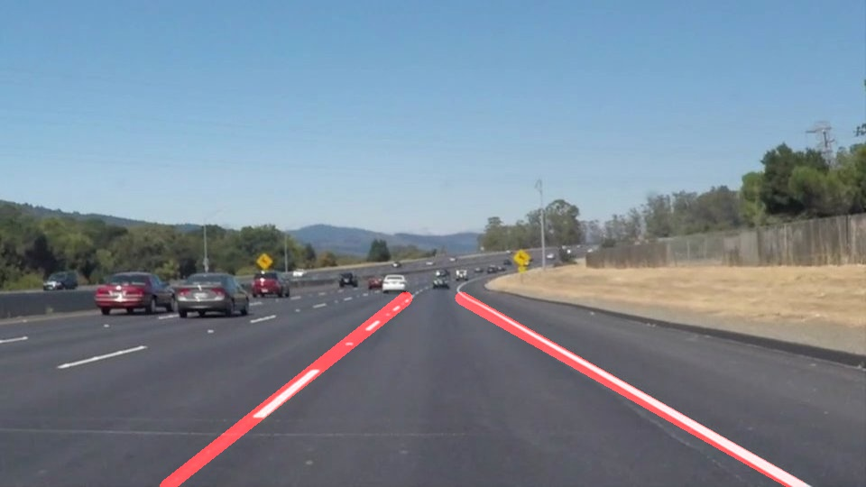
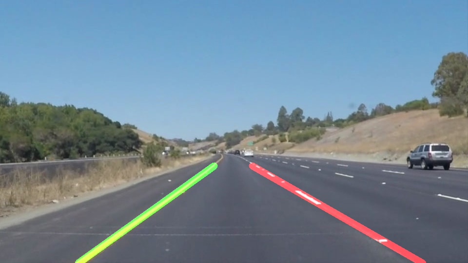

# **Finding Lane Lines on the Road** 

Overview
---
The aim of the project is to find lane lines via classic computer vision approaches. Although currently lane lines are found via using deeplearning methods,
this project aims to build fundamental baseline in lane finding. 

Pipeline
---
For this project, a lineDetector() class is created. This class contains all the necessary utility functions and also the pipelines for
bot video and  the images. 

Indicate if your are going to process raw frames or video.

For images use detector.process_folder_images() 

For videos use detector.line_detect_vid_pipeline()

Use main.py for generating detections.

1. lineDetector.line_detect_image_pipeline() function is the pipeline function:

    1.1 It takes images or frames
   
    1.2 Converts RGB image to Gray
    
    1.3 Applies Gaussian Blur
    
    1.4 Finds image's Otsu threshold
        
        Otsu's threshold is used as an automatic threshold value for Canny algorithm.
        
    1.5 Finds edges via Canny Edge Detection
    
    1.6 Takes a ROI and applies a ROI mask
    
    1.7 Finds lines via Hough Transform
    
    1.8 According to slope decides which lines are left line or right line
    
    1.9 Finds the average line slope and bias
    
    2.0 Find average line's x-points via 
        
        x=(y-b)/m
    
    2.1 Use image and ROI y limits with found x values and draw the lines    
        

Shortcommings
---
   - Detection will fail when lines are occluded
   - Only the straight lines can be found. In turns lines will get curvy and go outside the ROI
   - When camera resolution goes lower edge finding results will get worse
   - Video reading is done via opencv, faster libs can be used for faster processing

Improvements
---

- Consider finding better algorithm than Otsu
- Write an algorithms that finds the extend of the road ahead and use this extend for automatic ROI region  coord. definition
- If needed slope outliers should be considered

Results
---

The Project
---

## If you have already installed the [CarND Term1 Starter Kit](https://github.com/udacity/CarND-Term1-Starter-Kit/blob/master/README.md) you should be good to go!   If not, you should install the starter kit to get started on this project. ##

**Step 1:** Set up the [CarND Term1 Starter Kit](https://github.com/udacity/CarND-Term1-Starter-Kit/blob/master/README.md) if you haven't already.

**Step 2:** Open the code in a Jupyter Notebook

You will complete the project code in a Jupyter notebook.  If you are unfamiliar with Jupyter Notebooks, check out [Udacity's free course on Anaconda and Jupyter Notebooks](https://classroom.udacity.com/courses/ud1111) to get started.

Jupyter is an Ipython notebook where you can run blocks of code and see results interactively.  All the code for this project is contained in a Jupyter notebook. To start Jupyter in your browser, use terminal to navigate to your project directory and then run the following command at the terminal prompt (be sure you've activated your Python 3 carnd-term1 environment as described in the [CarND Term1 Starter Kit](https://github.com/udacity/CarND-Term1-Starter-Kit/blob/master/README.md) installation instructions!):

`> jupyter notebook`

A browser window will appear showing the contents of the current directory.  Click on the file called "P1.ipynb".  Another browser window will appear displaying the notebook.  Follow the instructions in the notebook to complete the project.  

**Step 3:** Complete the project and submit both the Ipython notebook and the project writeup

